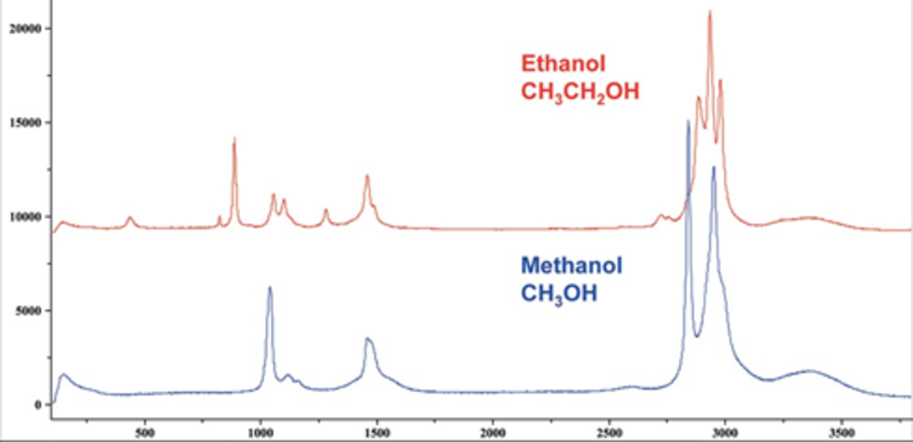

#  Understanding Principal Components Analysis for spectral analysis

[TOC]

## Preamble

The goal of this at this point is to understand Principal Components Analysis (PCA) in scikit-learn.decomposition.

I have done this by writing a sequence of tests that helped me understand what was going on.

This document is a work in progress and sections will improve with my understanding.

## Note

Use [Typora](http://typora.io) to read this document to see the equations.

## Introduction

Spectroscopy is the optical method of choice to detect substances or identify tissues.  We have learned from very early on that identifying the peaks in a spectrum can be done to infer the substances in our sample. For instance, if we have pure substances, it is relatively easy to identify Ethanol and Methanol with their Raman spectra, because their shapes are significantly different and many peaks do not overlap:

It may even be possible to separate both substances if we have a mixture of the two, by fitting $c_e S_(\nu)_{e} + c_m S(\nu)_{m}$ to find the appropriate concentrations that can explain our final combined spectrum. However, what do we do if we have a mixture of several solutions? What if several peaks overlap? What if we don't know the original spectra? 

We know intuitively that if peaks belong to the same molecule, they should vary together.  If by chance none of the peaks from the different analytes overlap, then it becomes trivial: we only need to identify the peaks, find their amplitudes, and we will quickly get the concentrations of the respective analytes. But things get complicated if they have overlapping peaks, and even worse if we have more than a few components.  

## Spectra as vectors

From a mathematical point of view, we can consider a spectrum as a **vector** of intensities:
$$
\mathbf{I} = \sum_{i=1}^{n} I_i\mathbf{\hat{\nu}}_i,
$$
where each individual frequency $\nu_i$ is in its own dimension, with $\hat{\nu}_i$ the base vectors and $I_i$ is the intensity at that frequency.  Therefore, if we have 1024 points in our intensity spectrum $\mathbf{I}$, we are in an N-dimensional space, with the components being $(I_1,I_2,...I_N)$, and we should assume (at least for now) that these components are all independent. If we define the **norm** of a vector from the **dot product**, we can say that the norm is equal to:
$$
\left|\mathbf{I} \right|^2 = \sum_{i=1}^{n} I_i\mathbf{\hat{\nu}}_i \cdot \sum_{j=1}^{n} I_j\mathbf{\hat{\nu}}_j = \sum_{i=1}^{n}\sum_{j=1}^{n} I_i I_j\ \hat{\nu}_i \cdot \hat{\nu}_j = \sum_{i=1}^{n} \left|I_i\right|^2,
$$
since the spectral base vectors $\hat{\nu}_i$ are all orthonormal, which we can use to normalize a spectrum (or a vector). Finally, it is very convenient to work with matrix notation to express many of these things.  We can express the spectrum $\mathbf{I}$ in the basis $\left\{ \hat{\nu}_i \right\}$ with:
$$
\mathbf{I} = \sum_{i=1}^{n} I_i\mathbf{\hat{\nu}}_i 
=
\left( \mathbf{\hat{\nu}}_1 \ \mathbf{\hat{\nu}}_2\  ...  \mathbf{\hat{\nu}}_n \right)
\left( I_1 \ I_2 \ ... \ I_n \right)^T
=
\left( \mathbf{\hat{\nu}}_1 \ \mathbf{\hat{\nu}}_2\  ...  \mathbf{\hat{\nu}}_n \right)
\left( 
\begin{matrix}
I_1 \\
I_2 \\
... \\
I_n \\
\end{matrix}
\right)
$$
If we consider these matrices as partitions, we can write in a form even more compact as:
$$
\mathbf{I} = \hat{\nu} [I]_\nu
$$
where the notation $\left[ I\right]_\nu$ means "the intensity coefficients in base $\nu$  to multiply the base vectors $\hat{\nu}$ and obtain the vector (spectrum)". We will use the transpose notation to keep expressions on a single line when needed.

Note that the vector itself $\mathbf{I}$ is different from the *components of that vector in a given basis* $[I]_\nu$.  For more information about the notation for vector, base vectors and coefficients:

* Read [Greenberg Section 10.7](./Greenberg base change.pdf) on bases and base changes.
* Watch [the video](https://www.youtube.com/watch?v=FNuKax5NEpw&list=PLUxTghemi4FvGibCevLK8S89Q7d_eC9HX&index=33) (in French) that explains in even more details where this comes from.
* Watch [an example](https://www.youtube.com/watch?v=REWGdCBoAxI&list=PLUxTghemi4FvGibCevLK8S89Q7d_eC9HX&index=32) (in French) for problem 10.7.1 that discussed an application of this notation and formalism to perform a base change.

## Spectra as *dependent* vectors

However, we know from experience that in a spectrum, intensities are not completely independent: for instance, in the methanol spectrum above, the peak around 1000 cm$^{-1}$ has a certain width and therefore those intensities are related and are not independent. In fact, for the spectrum of a single substance, *all intensities* are related because they will come from a scaled version of the original spectrum. Therefore, if we have the reference methanol spectrum for a unity concentration:
$$
\mathbf{\hat{b}}_M = \sum_{i=0}^{n} I_{M,i}\mathbf{\hat{\nu}}_i,
$$
where $I_{M,i}$ is the relative intensity at frequency $\nu_i$. Any other solution of methanol of scalar concentration $c_M$ would simply yield the spectrum:
$$
\mathbf{I} = c_M\mathbf{\hat{b}}_M = c_M \sum_{i=0}^{n} I_{M,i}\mathbf{\hat{\nu}}_i.
$$
So if we have several base solutions $\left\{\mathbf{\hat{b}}_j\right\}$ from which we create a mixture of concentrations $c_j$, we can write its spectrum $\mathbf{I}$ as:
$$
\mathbf{I} = \sum_j c_j\mathbf{\hat{b}}_j = \left( \mathbf{\hat{b}}_1, \mathbf{\hat{b}}_2,...,\mathbf{\hat{b}}_n \right)  \left( c_1, c_2,...,c_n \right)^T = \mathbf{\hat{b}}  [ c ]_\mathbf{B}
$$
Again, we read the last expression $\left[ c \right]_\mathbf{B} $ as "the coefficients in base $\left\{\mathbf{b}\right\}$  needed to multiply the base vectors $\mathbf{\hat{b}}_i$ to obtain the final spectrum $\mathbf{I}$". It stresses the point that the vector $\mathbf{I}$ and its components in a given basis are not the same thing. This will become critical below when we look a Principal Components.

Finally, if we want to describe a collection of $m$ spectra obtained from mixing these base solutions $\mathbf{b}$ with concentrations $c_{ij}$ for the i-th spectrum and the j-th base solution, we can write:

$$
\mathbf{I}_i = \sum_{j} c_{ij}\mathbf{\hat{b}}_j.
$$

This can be rewritten in matrix notation:
$$
\left( \mathbf{I}_1, \mathbf{I}_2,...,\mathbf{I}_n \right) = \left( \mathbf{\hat{b}}_1, \mathbf{\hat{b}}_2,...,\mathbf{\hat{b}}_n \right) 
\left( 
\begin{matrix}
c_{11} & c_{21} & ... & c_{m1} \\
c_{12} & c_{22} & ... & c_{m2} \\
... & ... & ...& ...\\
c_{1n} & c_{2n} & ... & c_{mn}
\end{matrix}
\right) 
$$

to yield this very compact form:
$$
\mathbf{I} = \mathbf{\hat{b}} \left[\mathbf{C}\right]_\mathbf{b}
$$

## Final notes on intensity spectra as vectors

If we have several components (i.e. methanol, ethanol, etc...) and there is no overlap whatsoever between the spectra (i.e the peaks are all distinct), then the base vectors $\hat{b}_i$ and $\hat{b}_j$ are orthogonal. However, it is more likely that the solutions *do* have overlapping spectra, therefore the base vectors (and consequently the base itself) will *not be orthogonal*. It is perfectly acceptable to have a base that is not orthogonal: it remains a base because any linear combination can create any spectrum we would measure.

## Base change

The general expression for a vector as a function of its basis and its components in that basis is such that obviously, it stands correct for any basis:
$$
\mathbf{I} = \mathbf{\hat{b}} \left[\mathbf{C}\right]_\mathbf{b} =\mathbf{\hat{b}^\prime} \left[\mathbf{C^\prime}\right]_\mathbf{b^\prime}
\label{eq:vectorBasis}
$$
It is the purpose of the present section to show how to go from a basis b to a basis b', that is, how to transform the coefficients c into coefficients c'. For more information, you can look at the [Youtube Video](https://www.youtube.com/watch?v=FNuKax5NEpw&list=PLUxTghemi4FvGibCevLK8S89Q7d_eC9HX&index=33) on base changes. 

Since we can express any vector in a basis, we can express the basis vectors $\mathbf{\hat{b}}$ in the $\mathbf{\hat{b}}^\prime$ basis:  
$$
\mathbf{\hat{b}} = \mathbf{\hat{b}}^\prime \left[ \mathbf{Q} \right]_{\mathbf{\hat{b}}^\prime},
\label{eq:bprimetob}
$$
where each column of the matrix is the components of the vector $\hat{b}_i$ in the $\hat{b}^\prime$ basis. By definition, a basis set has enough vectors to cover the vector space, therefore both basis sets must have the same number of vectors, and the matrix $\left[ \mathbf{Q} \right]_{\mathbf{\hat{b}}^\prime}$ is necessarily square, and can be inverted. We can therefore use $(\ref{eq:vectorBasis})$ in $(\ref{eq:bprimetob})$ and obtain simply:
$$
\mathbf{I} = \mathbf{\hat{b}} \left[\mathbf{C}\right]_\mathbf{b} 
=
\left( \mathbf{\hat{b}}^\prime \left[ \mathbf{Q} \right]_{\mathbf{\hat{b}}^\prime} \right)
\left[\mathbf{C}\right]_\mathbf{b}
=
\mathbf{\hat{b}}^\prime \left( \left[ \mathbf{Q} \right]_{\mathbf{\hat{b}}^\prime}
\left[\mathbf{C}\right]_\mathbf{b} \right)
=
\mathbf{\hat{b}^\prime} \left[\mathbf{C^\prime}\right]_\mathbf{b^\prime}
$$
This means that, when the vectors in different bases are expressed by $(\ref{eq:vectorBasis})$, the coordinates in the basis $\hat{b}^\prime$ can be obtained from the components in the basis $\hat{b}$ by this simple transformation:
$$
\left[\mathbf{C^\prime}\right]_\mathbf{b^\prime} \equiv \left[ \mathbf{Q} \right]_{\mathbf{\hat{b}}^\prime}
\left[\mathbf{C}\right]_\mathbf{b}
$$
 

## More base change

Equation $(\ref{eq:vectorBasis})$ is not the only possibility to express a vector in different basis.  We will see later that Principal Component Analysis often *translates* the sample vectors to the "origin" by subtracting the mean spectrum of all samples. This means that we have a more general transformation than $(\ref{eq:vectorBasis})$ in that we do not express $\mathbf{I}$ in a different set of coordinates but rather $\mathbf{I} - \bar{\mathbf{M}}$:
$$
\mathbf{I}-\mathbf{\bar{M}}= \mathbf{\hat{b}^\prime} \left[\mathbf{C^\prime}\right]_\mathbf{b^\prime}
\label{eq:vectorBasis2}
$$
